# streamable‑mcp‑client

**Real‑time *streaming* of MCP tools**

Streams MCP “notifications/message” events straight through to your UI and into the agent’s conversation history, _while the tool is still running_.

`streamable‑mcp‑client` glues **OpenAI Agents** to any MCP server that emits
**live notifications** (SSE and Streamable HTTP [openai-agents SDK support pending]).
With it you can build tools that:

* push incremental results (e.g. *“chunk #17 of your 1 GB file uploaded”*)
* let the assistant comment on notifications
* finish with a fully coherent, single‑run chat history without polling

Behind the scenes the library:

1. **Surfaces every `notifications/message` chunk immediately** as a normal `ResponseTextDeltaEvent`, so front‑ends (web, CLI, etc.) print progress in real time.
2. **Appends the chunk to the agent’s `RunResultStreaming.new_items` right away**, ensuring the LLM can reference it.
3. **Steps the agent forward exactly once** via a tiny helper patch (`Runner.continue_run`) so the next model delta reflects the fresh tool output.

The result: a chat experience where the assistant and the tool feel like a
single, smoothly streaming conversation.

### Reference servers `streamable‑mcp‑server`

That sibling repo ships **two demo servers**, but **⚠ note**:

*OpenAI Agents SDK v0.0.14* supports **only the legacy SSE transport**.
The newer **Streamable HTTP MCP** endpoint is included for **future‑proofing** and interop tests, but the Python client in this project will ignore it until the SDK adds native support.

| server file (repo root) | spec served | default port | endpoint | start command |
|-------------------------|-------------|--------------|----------|---------------|
| **`sseServer.ts`**      | **SSE MCP** (legacy – *supported* by openai‑agents) | **3000** | `http://localhost:3000/sse` | `npm run sse` |
| `mcpServer.ts`          | Streamable HTTP MCP (latest spec – *not yet supported* by openai‑agents) | **3000** | `http://localhost:3000/mcp` | `npm run mcp` |

> **Quick start:**
> 1. `git clone https://github.com/josephbharrison/streamable‑mcp‑server`
> 2. `cd streamable‑mcp‑server && npm ci`
> 3. `npx tsx watch sseServer.ts`   *(launches the compatible SSE server)*
> 4. In **this** repo, set the client mode to `"sse"` (default) and run `python src/main.py`.
---

# Diagram

### Call flow


1. **main.py** creates a normal OpenAI Agents Agent but wires in our custom MCPServerSseWithNotifications. It then calls StreamableAgent.run_streamed() for the *long‑running* tool request "stream up to 10 numbers.".

2. StreamableAgent.run_streamed() just forwards to the SDK’s Runner.run_streamed() and wraps the returned RunResultStreaming instance inside a **StreamableAgentStream** multiplexer.

3. **StreamableAgentStream** keeps **two** asyncio tasks running:
  - The agent’s *own* event generator (RunResultStreaming.stream_events()),
  - The **notification stream** produced by MCPServerSseWithNotifications.stream_notifications().
  - It emits a **single, unified** async stream that merges items from both.

4. Every time an SSE **notification chunk** arrives, the multiplexer
  - Exposes it immediately as a ResponseTextDeltaEvent (so the UI can print 1 2 3… in realtime),
  - Copies the text into RunResultStreaming.new_items **right now**,
  - Uses our patched helper Runner.continue_run() to step the outer agent forward **once**.
  - That lets the LLM “see” the latest tool output and decide what to say next while the tool is still running.

---

### OpenAI Agent Extensions

| file | what it adds |
|------|--------------|
| **mcp_extensions/server_with_notifications.py** | Sub‑class of the SDK’s `MCPServerSse` that<br>1. opens a **second** in‑memory stream for *logging* notifications, and<br>2. exposes a single async generator `stream_notifications()` that yields both **tool** notifications (from the SSE endpoint) **and** logging notifications injected by the server. |
| **mcp_extensions/streamable_agent_stream.py** | The heart of the realtime relay.<br>• Multiplexes the agent‑event task **and** the notification‑task.<br>• Converts each text chunk into the minimal set of UI events (*ItemAdded → ContentPartAdded → TextDelta → ContentPartDone*).<br>• Appends a completed `MessageOutputItem` to `run.new_items` so the LLM can reference it.<br>• Calls **`Runner.continue_run()`** (our SDK patch) to pull exactly **one** semantic event from the still‑running agent, then yields it downstream. |
| **mcp_extensions/streamable_agent.py** | Tiny convenience wrapper: given an `Agent` and an MCP server it returns a `StreamableAgentStream` each time you need a *streamed* call. |
| **main.py** | Diagnostic demo.<br>• Shows how to spin up the SSE server.<br>• Prints both raw model deltas **and** relay‑injected deltas in the console (see the two `if` branches in the loop). |

---

#### Sequence Diagram

```mermaid
sequenceDiagram
    %% concrete runtime objects
    participant Main    as main.py run()
    participant SA      as StreamableAgent
    participant SAS     as StreamableAgentStream
    participant Runner  as openai‑agents Runner
    participant MCP     as MCPServerSseWithNotifications
    participant SSE     as Remote SSE server

    %% 1 construction and first call
    Main  ->> SA      : run_streamed("stream up to 10 numbers")
    SA    ->> Runner  : run_streamed(agent,input)
    Runner-->> SA      : RunResultStreaming base_stream
    SA    -->> Main    : StreamableAgentStream instance (SAS)
    Note over Main,SAS: Main now iterates SAS.stream_events()

    %% 2 background tasks inside SAS
    Note over SAS,MCP: Task A base_stream.stream_events()  Task B MCP.stream_notifications()

    %% 2b open SSE channel for notifications
    SAS   ->> MCP     : subscribe_notifications
    MCP   ->> SSE     : HTTP GET /sse
    SSE  -->> MCP     : 200 OK (events begin)

    %% 2c legacy tool call via POST
    Runner->> MCP     : tools/call "stream_numbers"
    MCP   ->> SSE     : HTTP POST /sse?sessionId=<id>  JSON‑RPC body
    SSE  -->> MCP     : 200 OK (operation accepted)

    %% 3A normal model deltas
    SAS   ->> Runner  : Task A next base_stream event
    Runner-->> SAS     : RawResponsesStreamEvent (model delta or tool‑call)
    SAS   -->> Main    : same RawResponsesStreamEvent

    %% 3B notifications from SSE stream
    SSE  --) MCP      : event notifications/number 1
    MCP  --) SAS      : JSON‑RPC notification number 1
    SAS  --) Main     : ResponseTextDelta 1

    %% 4 commit chunk then advance agent one step
    SAS   ->> Runner  : continue_run(base_stream)
    Runner-->> SAS     : next model delta
    SAS  --) Main     : ResponseTextDelta from LLM

    %% … numbers 2 through 10 follow the same 3B and 4 cycle …

    %% 5 server closes the stream
    SSE  --) MCP      : event notifications/stream_end
    MCP  --) SAS      : stream_end sentinel
    Runner-->> SAS     : final assistant message
    SAS   -->> Main    : final assistant message
```



---

### Key methods in `StreamableAgentStream`

| method | purpose |
|--------|---------|
| `stream_events()` | Main coroutine. Runs two tasks (`agent_task`, `notif_task`), waits on whichever completes first, and yields events. Also honors the *grace period* (`_GRACE_TICKS`) so late notifications are still processed after the agent has finished. |
| `_handle_notification()` | For **one** `notifications/*` payload:<br>1&nbsp;· Converts its text into delta events for the UI.<br>2&nbsp;· Creates a *completed* assistant `MessageOutputItem` and appends it to the in‑flight run’s `new_items`.<br>3&nbsp;· Calls `Runner.continue_run()` **once** and yields that single event (usually a model delta or the final answer). |
| `_extract_text_chunks()` | Tiny helper that supports both the assistant‑style `{"content":[…{"type":"text"}…]}` payload **and** the flat `{"data":{"type":"text","text":"…"}` shape. |

---

### Why patch OpenAI Agents SDK?

#### Runner.continue_run

- The public SDK lets you **start** a streamed run and then iterate:

```
async for evt in run.stream_events(): ...
```

- But you can’t say “give me just the **next** event and then pause”.
- The realtime relay needs exactly that granularity: after *each* notification chunk it must
  1. Wake the agent,
  2. Wait for **one** event (usually a model delta),
  3. go back to waiting for the next notification.
- continue_run() is therefore a minimal, ~20‑line helper that peeks one item from the internal queue, taking care to propagate errors and to notice when the background task has already finished.


When the SDK one day exposes an official step() / poll() API the patch can be dropped.

---

### Extending / modifying

- **Richer notification payloads** (e.g. images, JSON)?

  Extend _extract_text_chunks() and the UI‑event construction logic.

- **Longer grace**

  Change _GRACE_TICKS (each tick = 100 ms).

- **Skip immediate model reaction** (pass‑through only)

  Remove the call to Runner.continue_run() in _handle_notification().

- **Multiple concurrent tools**

  Instantiate one StreamableAgentStream per tool invocation; each manages

  its own multiplexing.


## Patching the *openai‑agents* SDK

This repo relies on a **one‑liner helper** (`Runner.continue_run`) that is **not yet upstreamed** to *openai‑agents*.
We ship that change as a standard `git‑apply` patch.

|                  | path                                    |
| ---------------- | --------------------------------------- |
| patch file       | `patches/continue_run.patch`            |
| target file      | `<venv‑site‑pkgs>/agents/runner.py`     |

### Apply the patch

```bash
# from the repository root
git apply patches/continue_run.patch
```

or, if you prefer patch:
```bash
patch -p1 < patches/continue_run.patch
```

Tip 📦 If you vendor the SDK in ./libs/openai‑agents/, run the same command inside that folder.

### Verify

```bash
python - <<'PY'
from agents.runner import Runner
assert hasattr(Runner, "continue_run"), "patch did not apply!"
print("✅  continue_run helper is present")
PY
```

### Revert / re‑apply after upgrades
```
git apply -R patches/continue_run.patch   # ← undo
pip install --upgrade openai-agents       # upgrade SDK
git apply patches/continue_run.patch      # ← redo
```
